# FunCLIP-Pro · Tests 说明文档（测试图谱 + 新人导读）

> 本文档由 **CodeGraph** 对已建索引（`E:\project\funclip-pro\.codegraph`）执行 `sync → query/callers` 解析生成，
> 并结合 AST 静态分析逐文件判定每个测试到底在验证什么。它面向两类读者：
> **(1) 刚接手项目的新同学**，**(2) 准备接管开发的「新模型 / 接班 Agent」**。
> 读完你应该能在 10 分钟内搞清楚：有哪些测试、各自覆盖哪段源码、哪些能本地裸跑、哪些必须带 GPU 和模型。

---

## 0. 一句话定位

`funclip-pro` 是一个**中文语音识别（ASR）+ 说话人分离（Diarization）+ 标点恢复（PUNC）** 的多后端工具箱。
同一套业务链路下塞了多套可互换引擎：

| 能力 | 后端实现 |
|------|----------|
| ASR 主引擎 | **PyTorch**（SenseVoiceSmall, GPU）、**ONNX**（SenseVoiceSmall-ONNX, GPU/CPU）、**Sherpa-ONNX**（INT8, CPU）、**OpenVINO**（CPU 备选） |
| VAD 切片 | FSMN-VAD（PyTorch, CPU） |
| 说话人向量 | CampPlus（`speaker_engine.py`） |
| 分割引擎 | `segmentation_engine.py`（滑窗 + 合并） |
| 标点 | PUNC（`damo/punc_ct-transformer`）作为后处理 |

测试的核心目的就是：**保证这些可互换后端在「接口契约」「数值等价」「路由/回退逻辑」「路径解耦」上不退化**。

---

## 1. 测试图谱（CodeGraph 建图结果）

> 节点 = 测试文件；箭头 `→` 指向该测试**直接驱动/断言的源码符号或模块**（经 `codegraph callers` 校验）。
> 实线为 pytest 单测/集成；虚线框为独立基准/验证脚本（`main()` 入口，不走 pytest）。

```mermaid
graph TD
    %% A. ASR 服务层 & 引擎接口
    subgraph A["A. ASR 服务层 & 引擎接口"]
        ta[test_asr_api] --> asr[asr_service.py]
        tpi[test_pytorch_inference_refactor] --> asr
        tpr[test_pytorch_route] --> asr
        tpa[test_pytorch_affinity] --> asr
        tpp[test_pytorch_punc_load] --> punc[PUNC 标点模型]
        tpsi[test_pytorch_service_integration] --> asr
        tdf[test_decode_fallback] --> onxsvc[asr_onnx_service.py]
        tosi[test_onnx_service_integration] --> onxsvc
        tog[test_onnx_gpu] --> onxsvc
        tse[test_sherpa_engine] --> she["sherpa_engine.py (SherpaSenseVoice)"]
        tte[test_torch_engine] --> ten["torch_engine.py (PyTorchSenseVoice)"]
    end

    %% B. 路由 / 解码 / 线程
    subgraph B["B. 路由 / 解码 / 线程"]
        tr[test_routing] --> coreasr[funclip_pro/core/asr.py]
        taf[test_affinity] --> onxsvc
        tbd[test_batch_decode] --> core[funclip_pro/core]
        tod[test_onnx_decode_refactor] --> dec[decode 算法]
        tef[test_extract_feat] --> onnxm["SenseVoiceSmallONNX.extract_feat"]
        tso[test_session_options] --> onnxm
    end

    %% C. 说话人分离 / 分割 / VAD
    subgraph C["C. 说话人分离 / 分割 / VAD"]
        tsg[test_segmentation_engine] --> sege[segmentation_engine.py]
        tsl[test_sliding_segmentation] --> speak[speaker_engine.py]
        tsi[test_sliding_integration] --> speak
        tsc[test_seg_clustering] --> speak
        tsse[test_seg_seamless] --> speak
        tvs[test_vad_sliding] --> speak
        tvsc[test_vad_sherpa_comparison] --> vad[VAD+ASR 对比]
        tsp[test_sherpa_performance] --> she
        top[test_onnx_performance] --> onxsvc
        tov[test_openvino_speed] --> onnxm
    end

    %% D. 离线管道
    subgraph D["D. 离线管道 OfflinePipeline"]
        tou[test_offline_pipeline_unit] --> off[funclip_pro/pipeline/offline.py]
        toi[test_offline_pipeline_integration] --> off
    end

    %% E. 配置 / 路径 / 环境解耦
    subgraph E["E. 配置 / 路径 / 环境解耦"]
        tcl[test_config_loader] --> loader[funclip_pro/config/loader.py]
        tace[test_app_control_env] --> appc[app_control.py]
        tspa[test_service_paths] --> onxsvc
    end

    %% F. 基准 / 验证脚本
    subgraph F["F. 性能基准 & 验证脚本（非 pytest）"]
        bsp[bench_sherpa_vs_pytorch] --> she
        bsp --> asr
        tac[test_asr_comparison] --> asr
        tacc[test_asr_comparison_cpu] --> asr
        vps[verify_punc_sources] --> punc
    end
```



---

## 2. 测试总览矩阵（39 个测试文件）

> 依赖图例：**无模型** = 不加载权重、不需 GPU（仅装依赖即可跑）；**需模型** = 必须存在 `E:\project\funclip-pro\model\...`；
> **需GPU** = 需要 CUDA；**硬编码路径** = 测试里写死了作者机器路径，换环境必改。

| 测试文件 | 领域 | 被测目标 | 类型 | 依赖 | 一句话说明 |
|---|---|---|---|---|---|
| `test_asr_api.py` | A | `asr_service.py` | 单测+集成 | 无模型(mock) / 需GPU(real) | Mock 版彻底解耦 GPU；real 版在真机跑真实转写 |
| `test_pytorch_inference_refactor.py` | A | `asr_service.py` | 单测 | 无模型 | 验证 `run_inference_with_punc` 重构后链路正确 |
| `test_pytorch_route.py` | A | `asr_service.py` | 单测 | 无模型 | 验证 `transcribe` 默认走 VAD 路由 |
| `test_pytorch_affinity.py` | A | `asr_service.py` | 单测 | 无模型 | 校验进程 CPU 亲和性与线程数设置 |
| `test_pytorch_punc_load.py` | A | PUNC 模型 | 单测 | 需模型 | 标点模型能否成功加载 |
| `test_pytorch_service_integration.py` | A | `asr_service.py`(HTTP) | 集成 | 需GPU | 真实打 `/transcribe` 接口 |
| `test_decode_fallback.py` | A | `asr_onnx_service.py` | 单测 | 无模型 | 引擎路由 + **PyTorch→Sherpa 失败回退**，monkeypatch 注入假引擎 |
| `test_onnx_service_integration.py` | A | `asr_onnx_service.py`(HTTP) | 集成 | 需GPU | 真实打 ONNX 服务 `/transcribe` |
| `test_onnx_gpu.py` | A | ONNX pipeline+API | 集成 | 需GPU | FSMN-VAD(CPU)+SenseVoiceSmall-ONNX(GPU) 双模 pipeline + 端点验证 |
| `test_sherpa_engine.py` | A | `sherpa_engine.py` | 单测 | 需模型 | SherpaSenseVoice 加载与调用返回 list |
| `test_torch_engine.py` | A | `torch_engine.py` | 单测 | 需模型/可skip | 引擎接口契约：list[np.ndarray]→list[str] 且剥离 `<|...|>` 标签；无模型目录时跳过 |
| `test_routing.py` | B | `funclip_pro/core/asr.py` | 单测(TDD) | 无模型 | `_cheap_trim` / `_select_engine`(auto/cpu/gpu；短音频恒 Sherpa) / `strip_punctuation` / `_use_vad` 三态 |
| `test_affinity.py` | B | `asr_onnx_service.py` | 单测 | 无模型 | 进程 CPU 亲和性 ⊆ {0..5} |
| `test_batch_decode.py` | B | `funclip_pro/core` | 单测 | 需GPU/模型 | `SenseVoiceSmall` batch_size=2 多段解码 |
| `test_onnx_decode_refactor.py` | B | decode 算法 | 单测 | 无模型 | NumPy 向量化解码 ≡ 原 PyTorch/Python 循环解码（多 Batch 完全等价） |
| `test_extract_feat.py` | B | `SenseVoiceSmallONNX.extract_feat` | 单测 | 需模型 | 并发 vs 串行特征提取数值完全等价 |
| `test_session_options.py` | B | `SenseVoiceSmallONNX` | 单测 | 需模型 | 验证 ONNX SessionOptions 注入（intra_op=6, inter_op=1, 全图优化） |
| `test_segmentation_engine.py` | C | `segmentation_engine.py` | 单测 | 无模型(mock) | chunk 处理（静音/单人/双人/排除重叠帧）+ 长短音频分块 |
| `test_sliding_segmentation.py` | C | `speaker_engine.py` | 单测 | 无模型(mock) | `cluster_sliding` 滑动窗均值/合并/None 填充鲁棒性 |
| `test_sliding_integration.py` | C | 集成(diarize=sliding) | 集成 | 无模型(mock) | mock VAD/ASR/Cam++，验证返回带 speaker 的 segments |
| `test_seg_clustering.py` | C | `speaker_engine.py` | 单测 | 无模型(mock) | `cluster_with_segmentation` 双说话人聚类/合并/空/None 退化 |
| `test_seg_seamless.py` | C | `speaker_engine.py` | 单测 | 无模型(mock) | 无缝说话人时间轴（含 overlap 未知段锚点扩散），共 15 例 |
| `test_vad_sliding.py` | C | `speaker_engine.py` | 单测 | 无模型(mock) | `extract_embedding` 滑动均值/L2归一化，None/过短/Tensor 兼容/退化 |
| `test_vad_sherpa_comparison.py` | C | VAD+ASR 对比 | 基准 | 需模型+音频 | PyTorch FP32 vs Sherpa-ONNX INT8：延迟/CER/RTF 报告 |
| `test_sherpa_performance.py` | C | Sherpa-ONNX | 基准 | 需模型+音频 | 加载/冷启动/热启动耗时与 RTF |
| `test_onnx_performance.py` | C | ONNX pipeline | 基准 | 需GPU/模型 | VAD+ASR ONNX 双模性能对比 |
| `test_openvino_speed.py` | C | `SenseVoiceSmallONNX` | 基准 | 需模型 | ONNX Runtime vs OpenVINO CPU 推理速度对照 |
| `test_offline_pipeline_unit.py` | D | `funclip_pro/pipeline/offline.py` | 单测 | 无模型 | 15 例：构造不加载权重、模型目录解析、two_stage 默认策略、SRT 工具、assign_clauses（含 seamless） |
| `test_offline_pipeline_integration.py` | D | `funclip_pro/pipeline/offline.py` | 集成 | 需GPU/模型 | seg_clustering 端到端；默认跳过，需 `FUNCLIP_INTEGRATION=1` 或 `pytest -m ml` |
| `test_config_loader.py` | E | `funclip_pro/config/loader.py` | 单测(P0) | 无模型 | PROJECT_ROOT、resolve_model_path(default/env)、apply_dll_patch(non-win32)、无 yaml 回退 |
| `test_app_control_env.py` | E | `app_control.py`(经 loader) | 单测(TDD) | 无模型 | 验证 Windows 绝对路径已解耦；loader 读 offline_python/conda_root；**严禁 import app_control**；正则断言无盘符硬编码 |
| `test_service_paths.py` | E | `asr_onnx_service.py`(经 loader) | 单测(P0) | 无模型 | 路径解耦校验：resolve_model_path/PROJECT_ROOT/FUNCLIP_MODEL_ROOT 覆盖；无硬编码盘符 |
| `bench_sherpa_vs_pytorch.py` | F | Sherpa vs PyTorch | 基准脚本 | 需GPU+模型+音频 | Sherpa-ONNX(CPU) vs PyTorch(GPU) 对比，输出 `bench_report.json`（**非 pytest**） |
| `test_asr_comparison.py` | F | asr_service / asr_onnx_service | 基准脚本 | 需GPU+模型+音频 | 自动启停 8001/8002 服务，对比耗时与 CER（**非 pytest**） |
| `test_asr_comparison_cpu.py` | F | 同上 | 基准脚本 | 需模型+音频 | 同上但 `FORCE_CPU=1`（**非 pytest**） |
| `verify_punc_sources.py` | F | PUNC 来源验证 | 验证脚本 | 需模型+音频 | 验证 Sherpa-ONNX 与原生 PyTorch 原始输出是否自带标点，决定迁移后是否保留 PUNC（**非 pytest**） |

> 另有 `__pycache__/`、`bench_report.json`（基准产物）等非测试文件，不在统计内。

---

## 3. 分模块详解

### A. ASR 服务层 & 引擎接口
两条并行的 FastAPI 服务：
- **8001 = `asr_service.py`**（PyTorch SenseVoice，GPU 优先）：由 `test_asr_api`/`test_pytorch_*` 覆盖。
  - `test_asr_api::test_transcribe_endpoint_with_mock` 用 Mock 顶掉 ASR+VAD，**彻底解耦 GPU**，是 CI 里最该跑通的用例；
  - `test_pytorch_inference_refactor` / `test_pytorch_route` 锁定重构后的 `run_inference` 与默认 VAD 路由；
  - `test_pytorch_affinity` 锁 CPU 亲和性。
- **8002 = `asr_onnx_service.py`**（ONNX / Sherpa）：由 `test_decode_fallback` / `test_onnx_service_integration` 覆盖。
  - `test_decode_fallback` 是**最关键的逻辑测试**：用假引擎驱动 `_decode`，断言「torch 成功→返回 torch 结果；torch 抛错→回退 Sherpa 并仍返回」，保证后端可降级。
- 引擎包装层：`test_sherpa_engine`（`SherpaSenseVoice`）、`test_torch_engine`（`PyTorchSenseVoice` 接口契约，无模型目录自动 skip）。

### B. 路由 / 解码 / 线程
- `test_routing` 是**纯算法 TDD 单测**（不加载任何模型），锁定 `funclip_pro/core/asr.py` 里的核心策略：
  `_cheap_trim`（仅 librosa 去静音）、`_select_engine`（auto 下短音频恒走 Sherpa、长音频按 CUDA 可用性选 torch/sherpa）、`strip_punctuation`、`_use_vad` 三态。**这是新人理解「引擎怎么选」的第一入口**。
- `test_onnx_decode_refactor`：证明新 NumPy 向量化解码与原 Python 循环解码**数值完全等价**——重构安全性护栏。
- `test_batch_decode` / `test_extract_feat` / `test_session_options`：围绕 `SenseVoiceSmallONNX` 的批解码、特征提取并发等价、ONNX SessionOptions 注入（性能调优参数）。

### C. 说话人分离 / 分割 / VAD
本目录测试密度最高，因为 diarization 是项目复杂度核心：
- **分割引擎** `test_segmentation_engine`：mock 模型，验证 chunk/整段处理、重叠帧排除、长短音频分块。
- **滑动窗聚类** `test_sliding_segmentation` + `test_vad_sliding`：`speaker_engine.CampPlusSpeaker` 的 `cluster_sliding` 与滑动均值 embedding，重点测 **None/过短/退化不崩**。
- **两段式聚类** `test_seg_clustering`：`cluster_with_segmentation`，双说话人聚类与合并阈值（间隔 0.5s）。
- **无缝时间轴** `test_seg_seamless`（15 例）：处理含 `overlap` 未知段的时间轴，**子句落未知段时取最近确定段说话人（锚点扩散）**——这是相对最新的功能，测试最细。
- **集成** `test_sliding_integration`：mock 掉 VAD/ASR/Cam++，直接验证 `diarize_strategy=sliding` 返回带 speaker 的 segments。
- **性能/对比** `test_vad_sherpa_comparison` / `test_sherpa_performance` / `test_onnx_performance` / `test_openvino_speed`：量化各后端延迟、RTF、CER，用于选型。

### D. 离线管道 `funclip_pro/pipeline/offline.py`
- `test_offline_pipeline_unit`（15 例，**不依赖 GPU**）：lazy 构造（`auto_load=False` 不触发权重加载）、模型目录解析、`two_stage` 默认策略、SRT 工具（`_ms_to_srt` 进位/补零）、`assign_clauses` 子句→说话人分配（含 seamless 锚点扩散）。
- `test_offline_pipeline_integration`：真机端到端跑 `seg_clustering`，**默认跳过**，需 `FUNCLIP_INTEGRATION=1` 或 `pytest -m ml`。这是 DER（说话人错误率）门禁。

### E. 配置 / 路径 / 环境解耦（P0 收尾产物）
这批测试来自「把 Windows 绝对路径从源码里抠掉、改由 `config.yaml` + 环境变量驱动」的重构：
- `test_config_loader`：loader 的 PROJECT_ROOT / resolve_model_path / env 覆盖 / 无 yaml 回退。
- `test_app_control_env`：**严禁 `import app_control`**（会触发 gradio 与 CPU 亲和性），只依赖 `funclip_pro.config.loader` + 读源码文本，用正则断言无 `C:\`/`E:\` 硬编码。
- `test_service_paths`：对 `asr_onnx_service.py` 做同样的路径解耦 + 无盘符硬编码断言。
> 这三个文件是**移植到 Docker / 换机部署的安全网**，改路径相关代码务必跑。

### F. 性能基准 & 验证脚本（不走 pytest）
`bench_sherpa_vs_pytorch.py`、`test_asr_comparison.py`、`test_asr_comparison_cpu.py`、`verify_punc_sources.py`
都是 `if __name__ == "__main__": main()` 的独立脚本，需要作者机器上的模型目录与 `李雪花2.wav` 音频，产出对比表或 `bench_report.json`。**它们不属于 CI，是手动选型/回归工具。**

---

## 4. 给新人 / 接班模型的「一页纸心智模型」

一次转写请求是怎么流动的：

```
音频 ──► VAD 切片(FSMN, CPU)
        │
        ├─► ASR 引擎(按 _select_engine 路由)
        │     ├─ 短音频 / 无CUDA ─► Sherpa-ONNX(INT8, CPU)
        │     └─ 长音频 + CUDA   ─► PyTorch SenseVoice(GPU) 或 SenseVoiceSmall-ONNX(GPU)
        │
        ├─► 说话人分离(speaker_engine.CampPlusSpeaker)
        │     ├─ two_stage 策略  ─► segmentation_engine + cluster_with_segmentation
        │     └─ sliding 策略    ─► cluster_sliding（无缝时间轴，overlap 段走锚点扩散）
        │
        └─► PUNC 标点后处理（剥原生标点 → 拼全文 → PUNC 一次）
```

**关键认知：**
1. 双服务架构：8001=PyTorch，8002=ONNX/Sherpa。多数「对比」测试就是在比这两家的延迟与一致度（CER）。
2. **引擎可降级**：ONNX 服务的 `_decode` 在 torch 失败时会回退 Sherpa（`test_decode_fallback` 守护）。
3. **短音频永远走 Sherpa-CPU**（`test_routing` 守护），这是延迟优化关键。
4. 路径已全部相对化 + 由 `config.yaml` / `FUNCLIP_MODEL_ROOT` 驱动（`test_config_loader` / `test_service_paths` / `test_app_control_env` 守护），不要再往源码里写死盘符。

**建议阅读顺序（从抽象到具体）：**
1. `README.md` / `README_zh.md`（项目总览）→ 2. `funclip_pro/core/asr.py`（路由核心，`test_routing` 对照读）→
3. `funclip_pro/pipeline/offline.py`（`test_offline_pipeline_unit` 对照读）→
4. `speaker_engine.py` + `segmentation_engine.py`（`test_seg_*` / `test_sliding_*` 对照读）→
5. `asr_service.py` / `asr_onnx_service.py`（服务层，`test_*`_api / `test_decode_fallback` 对照读）。

---

## 5. 如何运行

```bash
# 0) 用项目虚拟环境（脚本里硬编码的是 E:\conda\envs\asr_ui_env）
cd E:\project\funclip-pro

# 1) 纯单测（不加载模型权重、不需要 GPU，但需装 torch/funasr/onnxruntime）
pytest tests/test_routing.py tests/test_decode_fallback.py \
       tests/test_config_loader.py tests/test_app_control_env.py tests/test_service_paths.py \
       tests/test_onnx_decode_refactor.py tests/test_segmentation_engine.py \
       tests/test_seg_clustering.py tests/test_seg_seamless.py \
       tests/test_sliding_segmentation.py tests/test_sliding_integration.py \
       tests/test_offline_pipeline_unit.py tests/test_vad_sliding.py tests/test_affinity.py

# 2) 需真实模型的引擎/性能测试（机器上有 model/ 且音频就位）
pytest tests/test_sherpa_engine.py tests/test_extract_feat.py tests/test_session_options.py \
       tests/test_batch_decode.py tests/test_onnx_gpu.py

# 3) 集成测试（需要 GPU + 真模型），默认跳过
FUNCLIP_INTEGRATION=1 pytest tests/test_offline_pipeline_integration.py
# 或用 marker
pytest -m ml

# 4) 独立基准/验证脚本（非 pytest，直接 python 跑，依赖作者机器路径）
python tests/bench_sherpa_vs_pytorch.py
python tests/test_asr_comparison.py
python tests/test_asr_comparison_cpu.py
python tests/verify_punc_sources.py
```

---

## 6. ⚠️ 移植 / 接手必看的坑

1. **大量测试硬编码了作者机器路径**：`E:\project\funclip-pro\model\...`、`E:\下载\下载\李雪花2.wav`、`E:\conda\envs\asr_ui_env\python.exe`。
   换环境（尤其非 Windows / Docker）跑之前，**先改这些绝对路径**或改为相对/环境变量，否则直接 `FileNotFoundError` / `AssertionError`。
2. **F 类脚本不是 pytest 用例**：`bench_*`、`test_asr_comparison*`、`verify_punc_sources` 是手动选型工具，`pytest` 收集不到它们的 `main()`。
3. **unittest 风格与 pytest 风格混用**：`test_seg_clustering` / `test_seg_seamless` / `test_segmentation_engine` 是 `unittest.TestCase`，其余多为函数式 `test_*`。两者 pytest 都能跑，但阅读时注意类方法前缀。
4. **mock 边界**：A/C 的集成测试普遍用 MagicMock 顶掉模型，**不验证识别正确性，只验证链路与结构**；识别质量要靠 F 类基准 + `bench_report.json` 看 CER。
5. **`test_app_control_env` 不能 import app_control**：违反会拉起 gradio/CPU 亲和性，破坏沙箱。

---

## 7. 附：CodeGraph 复现命令

```bash
cd E:\project\funclip-pro
codegraph status            # 查看索引统计（files/nodes/edges）
codegraph sync              # 源码变动后增量更新索引
codegraph callers _select_engine          # 看谁调用了某个核心符号
codegraph callers cluster_with_segmentation
codegraph query resolve_model_path
```

> 索引库位于 `E:\project\funclip-pro\.codegraph\codegraph.db`（node:sqlite，WAL）。
